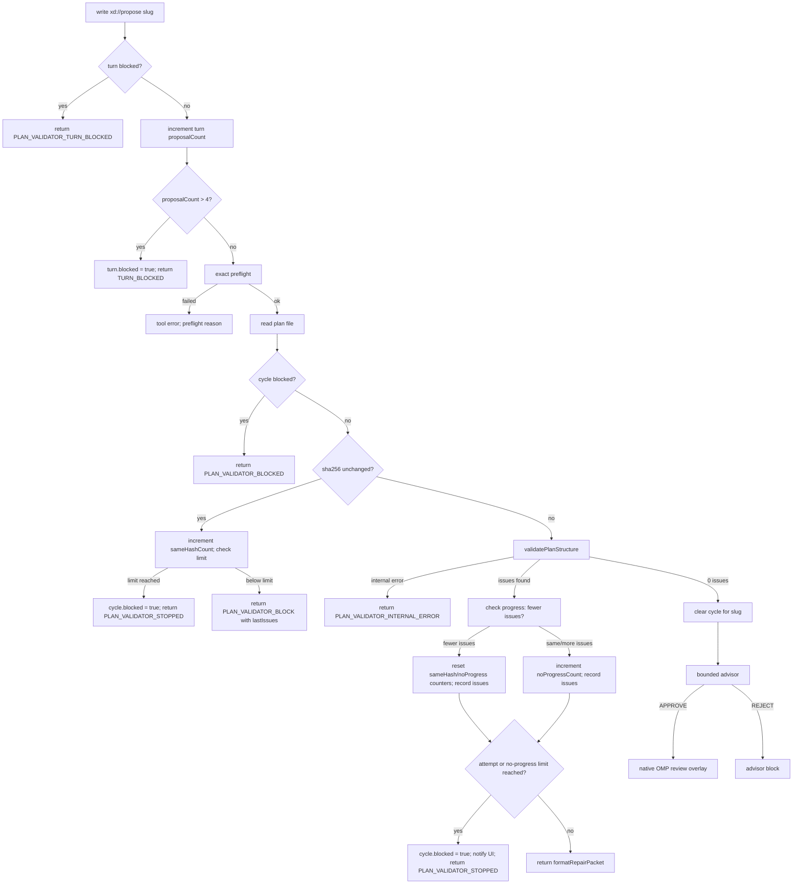

# Сходимость Plan Validator и защита от бесконечных исправлений

Дата: 2026-09-04
Статус: анализ завершён; контроллер сходимости и пакетный validator реализованы.

## Проблема

Наивная схема:

```text
validator нашёл одну ошибку
  → модель исправила план
  → validator нашёл следующую ошибку
  → модель снова исправила план
  → повторять бесконечно
```

Это создаёт три риска:

1. лишние ходы модели и расход контекста;
2. отсутствие у автора полного объяснения, что именно требуется исправить;
3. отсутствие гарантии остановки, если модель исправляет одно нарушение и создаёт другое.

Проблема реальна. Одного факта, что `tool_call` возвращает ошибку инструмента, недостаточно.
Нужны одновременно полный пакет исправления, обнаружение отсутствия прогресса и жёсткий предел
автоматических попыток.

## Подтверждённый OMP-контракт

| Факт | Доказательство |
|---|---|
| Hook `tool_call` вызывается до запуска инструмента | `.../src/extensibility/hooks/tool-wrapper.ts:43-67` |
| `{ block: true, reason }` превращается в ошибку инструмента и блокирует запуск | `.../src/extensibility/hooks/tool-wrapper.ts:57-67` |
| Ошибка hook передаётся обратно в agent loop, а `tool_result` помечается `isError: true` | `.../src/extensibility/hooks/tool-wrapper.ts:84-119` |
| `ExtensionContext.ui.notify(message, type)` существует для сообщения человеку | `.../src/extensibility/extensions/types.ts:254-283` |
| `ExtensionContext.abort()` внутри `tool_call` заменяет содержательный reason общей ошибкой отмены | `.../src/extensibility/extensions/runner.ts:1481-1483`; `.../src/agent-loop.ts:2110-2205` |
| Пакетные tool calls: OMP запускает hooks для всех вызовов пакета до выполнения первой записи | `.../src/agent-loop.ts:2458-2469` |
| `session_stop` с `continue`/`decision:block` создаёт скрытое продолжение, а не обычное окно исправления | `.../src/extensibility/shared-events.ts:393-405`; `.../src/session/agent-session.ts:3470-3558` |
| Встроенный OMP prompt уже требует исправлять и повторно передавать тот же slug/файл | `.../src/prompts/system/plan-mode-active.md` |
| OMP native `write xd://propose` передаёт title в plan handler; вложенного второго hook нет | `.../src/tools/resolve.ts:282-304`; `.../src/tools/write.ts:1144-1170` |

### Гонка пакетных вызовов `write local://...` + `write xd://propose`

В OMP (`agent-loop.ts:2458-2469`), когда модель отправляет несколько вызовов инструментов в одном ходе (например, `write local://feature-plan.md` и затем `write xd://propose feature`), OMP сначала последовательно вызывает все `tool_call` hooks для каждого инструмента в пакете ДО того, как физически исполнится хоть одна запись на диск.

В результате preflight для `write xd://propose` запускается, когда файл `local://feature-plan.md` ещё не существует на диске, и завершается с `PLAN_FILE_MISSING`. Поэтому модель обязана вызывать `write xd://propose` отдельным последующим ходом после подтверждения записи файла.

### Почему отклонён `ctx.abort()` в пользу sticky turn latch

Первоначальный кандидат предполагал вызов `ctx.abort()` внутри `tool_call` при превышении лимитов. Однако исследование исходного кода OMP (`runner.ts:1481-1483`, `agent-loop.ts:2110-2205`) показало:
1. `ctx.abort()` немедленно прерывает выполнение и заменяет возвращаемый `reason` на стандартную системную ошибку прерывания операции (`Operation aborted`).
2. В результате модель и пользователь теряют структурированный список оставшихся дефектов и инструкцию по выходу из тупика.
3. Вместо этого применён доказанный **sticky turn latch**: при исчерпании лимитов цикл и ход помечаются как `blocked = true`. Все последующие попытки вызова `xd://propose` в текущем ходе немедленно отклоняются за $O(1)$ без валидатора, без обращения к диску и без вызова LLM-советника, сохраняя полное сообщение `[PLAN_VALIDATOR_STOPPED]` в transcript.
4. Новый пользовательский prompt или нативное действие `Refine plan` запускает событие `before_agent_start`, которое сбрасывает latch и предоставляет новый бюджет на исправление.

## Решение

В существующий `tool_call` добавляется чистый пакетный валидатор структуры и детерминированный контроллер сходимости.

```text
exact preflight
  → прочитать exact plan
  → если cycle.blocked → вернуть [PLAN_VALIDATOR_BLOCKED] за O(1)
  → если sha256 не изменился → повторить lastIssues, увеличить sameHashCount
  → иначе validatePlanStructure собирает все ошибки снимка
  → если есть ошибки → оценить прогресс (count & signature), обновить cycle
  → при исчерпании лимитов → sticky stop + notification
  → при наличии бюджета → repair packet + reject receipt
  → при 0 ошибок → bounded advisor → native OMP review
```

## 1. Пакетный валидатор структуры (`plan-validator.ts`)

Валидатор разбирает Markdown-заголовки уровня `##` вне code fences. Проверяет канонический контракт плана:
- Обязательные непустые секции: `Context`, `Approach`, `Verification` в указанном порядке.
- Допустимые опциональные секции: `Critical files & anchors` (между `Approach` и `Verification`), `Assumptions & contingencies` (после `Verification`).
- За один проход собираются все независимые нарушения (`PLAN_EMPTY`, `SECTION_MISSING`, `SECTION_DUPLICATE`, `SECTION_ORDER`, `SECTION_EMPTY`).
- Для отсутствующих секций зависимые `SECTION_EMPTY` и `SECTION_ORDER` подавляются.
- Ошибки сортируются по позиции в файле, затем по коду и секции, гарантируя детерминированный вывод.
- `issueSignature` строится из отсортированных пар `code + section` без номеров строк, исключая ложный "прогресс" при косметическом форматировании.

## 2. Формат repair packet

```text
[PLAN_VALIDATOR_BLOCK] Plan validation failed (Attempt 1 of 3):

1. [SECTION_MISSING] Context: Required section "Context" is missing. Fix: Add "## Context" section to the plan.
2. [SECTION_ORDER] Approach, line 15: Section "Approach" at line 15 is out of order (must appear before "Verification"). Fix: Move "## Approach" before "## Verification".

Fix every issue above in local://feature-plan.md, keep the same slug, reread the complete plan, and do not call xd://propose until all listed issues are fixed.
```

## 3. Детерминированные пределы сходимости

Контроллер защищён четырьмя жёсткими пределами:
- `MAX_FAILED_VALIDATIONS = 3`: максимум 3 неудачные попытки на slug в ходе;
- `MAX_SAME_HASH_REPEATS = 2`: максимум 2 повтора без изменения файла;
- `MAX_NO_PROGRESS_ATTEMPTS = 2`: максимум 2 попытки без уменьшения числа ошибок;
- `MAX_TURN_PROPOSALS = 4`: максимум 4 предложения в одном ходе (защита от перебора slug).

Пятый proposal в ходе блокирует ход (`[PLAN_VALIDATOR_TURN_BLOCKED]`).

## Визуальный контур сходимости



## Итог

Архитектура сохранена и защищена:
1. Валидатор возвращает все ошибки одним пакетом.
2. Контроллер сходимости отслеживает реальное уменьшение числа ошибок.
3. Sticky turn latch гарантирует остановку без искажения причин отмены.
4. Advisor вызывается строго после прохождения валидатора.
